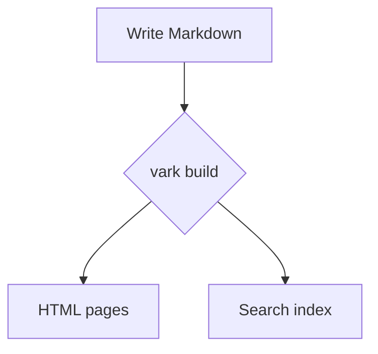

# Markdown reference

aardvark renders Markdown with [markdown-it](https://github.com/executablebooks/markdown-it-py),
following the [CommonMark](https://commonmark.org) spec with **tables**, **strikethrough**,
**footnotes**, **smart typography**, and **automatic links** turned on. This page shows the
source for every element next to its live result — copy any block straight into your own pages.

## Headings

Six levels, from `#` to `######`:

```markdown
# Heading level 1
## Heading level 2
### Heading level 3
#### Heading level 4
##### Heading level 5
###### Heading level 6
```

renders, live:

# Heading level 1
## Heading level 2
### Heading level 3
#### Heading level 4
##### Heading level 5
###### Heading level 6

Levels 1–4 get a stable `id`, a permalink that fades in when you hover, and an entry in the
**On this page** table of contents; levels 5 and 6 render but stay out of the TOC. (Because the
six lines above are real headings, you will see levels 1–4 appear in this page's TOC.) Pin a
custom id by ending a heading line with `{#my-id}` — see
[Templating & data](/authoring/templating/) for more.

## Paragraphs and line breaks

Separate paragraphs with a blank line. A single newline just soft-wraps. For a hard line break,
end a line with two trailing spaces or a backslash `\`:

```markdown
First paragraph.

Second paragraph,\
forced onto a new line within the same paragraph.
```

renders, live:

First paragraph.

Second paragraph,\
forced onto a new line within the same paragraph.

## Text formatting

```markdown
**Bold** and __bold__, *italic* and _italic_, ***bold italic***,
~~strikethrough~~, and `inline code`.
```

renders, live:

**Bold** and __bold__, *italic* and _italic_, ***bold italic***,
~~strikethrough~~, and `inline code`.

## Smart typography

With the typographer on, straight quotes curl, hyphens become dashes, and a few symbols are
replaced automatically:

```markdown
"Double" and 'single' quotes, an en -- dash, an em --- dash, an ellipsis...,
plus (c), (r), and (tm).
```

renders, live:

"Double" and 'single' quotes, an en -- dash, an em --- dash, an ellipsis...,
plus (c), (r), and (tm).

## Links

```markdown
An [inline link](https://mantine.dev), a [link with a title](https://mantine.dev "Mantine docs"),
and a [reference-style link][mantine]. Bare URLs auto-link: https://commonmark.org — as do
angle-bracketed ones like <https://mantine.dev> and emails like <hello@example.com>.

[mantine]: https://mantine.dev
```

renders, live:

An [inline link](https://mantine.dev), a [link with a title](https://mantine.dev "Mantine docs"),
and a [reference-style link][mantine]. Bare URLs auto-link: https://commonmark.org — as do
angle-bracketed ones like <https://mantine.dev> and emails like <hello@example.com>.

[mantine]: https://mantine.dev

## Inline HTML

Raw HTML passes straight through, which covers the few things CommonMark leaves out:

```html
Press <kbd>Cmd</kbd> + <kbd>K</kbd>. You can <mark>highlight</mark> text, write H<sub>2</sub>O
and E = mc<sup>2</sup>, and define <abbr title="HyperText Markup Language">HTML</abbr>.
```

renders, live:

Press <kbd>Cmd</kbd> + <kbd>K</kbd>. You can <mark>highlight</mark> text, write H<sub>2</sub>O
and E = mc<sup>2</sup>, and define <abbr title="HyperText Markup Language">HTML</abbr>.

A `<details>` element makes a native, no-JavaScript disclosure:

```html
<details>
<summary>Show more</summary>

Hidden content that expands when you click the summary.

</details>
```

renders, live:

<details>
<summary>Show more</summary>

Hidden content that expands when you click the summary.

</details>

## Blockquotes

aardvark renders a Markdown blockquote as an island rather than a plain `<blockquote>`: a
plain `>` becomes an untitled notification — the same one
[``](/components/feedback/notification/) emits with its
defaults — while an alert marker promotes it to a colored [callout](/components/feedback/callout/)
(see below). The body is full Markdown:

```markdown
> A blockquote renders as a notification. The body is full Markdown:
>
> - **formatting** and `inline code`
> - lists, too
```

renders, live:

> A blockquote renders as a notification. The body is full Markdown:
>
> - **formatting** and `inline code`
> - lists, too

### GitHub-style alerts

Begin a blockquote with an alert marker — `[!NOTE]`, `[!TIP]`, `[!IMPORTANT]`,
`[!WARNING]`, or `[!CAUTION]` — and it renders as a [callout](/components/feedback/callout/)
with a matching color and title:

```markdown
> [!NOTE]
> Useful information that users should know, even when skimming.

> [!TIP]
> A helpful suggestion for doing things better.

> [!IMPORTANT]
> Key information users need in order to succeed.

> [!WARNING]
> Urgent information that needs immediate attention.

> [!CAUTION]
> Advises about risks or negative outcomes of an action.
```

renders, live:

> [!NOTE]
> Useful information that users should know, even when skimming.

> [!TIP]
> A helpful suggestion for doing things better.

> [!IMPORTANT]
> Key information users need in order to succeed.

> [!WARNING]
> Urgent information that needs immediate attention.

> [!CAUTION]
> Advises about risks or negative outcomes of an action.

## Lists

**Unordered** lists accept `-`, `*`, or `+` as the marker:

```markdown
- First item
- Second item
  - Nested item
  - Another nested item
- Third item
```

renders, live:

- First item
- Second item
  - Nested item
  - Another nested item
- Third item

**Ordered** lists use `1.`, `2.`, and so on:

```markdown
1. Step one
2. Step two
3. Step three
```

renders, live:

1. Step one
2. Step two
3. Step three

A numbered list can also **start at a custom number** — the first item sets the
starting value and the rest count on from there. Keep it as its own list (separated
by intervening text), since adjacent numbered items merge into one list:

```markdown
5. This list starts at five
6. and counts on from there
```

renders, live:

5. This list starts at five
6. and counts on from there

Top-level numbered lists render as a [Steps](/components/navigation/steps/) timeline by default
— the numbered-badge layout above. Set `steps: false` in `aardvark.config.yaml` to
keep plain `<ol>` numbering instead; nested numbered lists and bullet lists are left
as-is either way.

**Mixed and nested**, with a list item that carries several blocks:

```markdown
1. Ordered parent
   - Unordered child
   - Another child
2. Second parent

   A second paragraph that belongs to item 2.

   > And a blockquote, indented to stay inside the item.
```

renders, live:

1. Ordered parent
   - Unordered child
   - Another child
2. Second parent

   A second paragraph that belongs to item 2.

   > And a blockquote, indented to stay inside the item.

### Task lists

Begin a list item with `[ ]` or `[x]` and it renders as a Mantine checkbox — checked when the
brackets hold an `x` (upper- or lower-case). Everything after the marker is the label, so
inline formatting like `code` and **emphasis** works inside it. The boxes are interactive — a
reader can toggle them — but the state isn't stored, so it resets on reload to match the source:

```markdown
- [x] Draft the page
- [ ] Review it with the team
- [ ] Ship it, then update `CHANGELOG.md` and **announce**
```

renders, live (try toggling one):

- [x] Draft the page
- [ ] Review it with the team
- [ ] Ship it, then update `CHANGELOG.md` and **announce**

### Definition lists (not enabled)

Definition lists are **not** turned on, so the `Term` / `: Definition` syntax falls back to
plain text rather than rendering as term/definition pairs:

```markdown
Term
: Definition
```

renders, live (note the leading colon is kept verbatim):

Term
: Definition

## Tables

Pipe tables come from the enabled `table` rule. A colon in the divider row sets each column's
alignment — left (`:---`), center (`:--:`), or right (`---:`). Cells accept inline formatting:

```markdown
| Element      |          Example            |   Done |
| :----------- | :-------------------------: | -----: |
| Bold         |        `**bold**`           |    Yes |
| A link       | [docs](https://mantine.dev) |    Yes |
| Escaped pipe |          a \| b             |    Yes |
```

renders, live:

| Element      |          Example            |   Done |
| :----------- | :-------------------------: | -----: |
| Bold         |        `**bold**`           |    Yes |
| A link       | [docs](https://mantine.dev) |    Yes |
| Escaped pipe |          a \| b             |    Yes |

## Code

Inline code uses single backticks: `print("hi")`. To include a literal backtick, wrap the span
in two backticks: `` `not code` ``.

A fenced block takes an optional language label, and aardvark highlights it at build time with
[Pygments](https://pygments.org) — no client-side highlighter or extra JavaScript to load. Under
`theme.syntax` in `aardvark.config.yaml` you can pick a preset per color scheme (any Pygments style —
the default `one-light` / `one-dark`, or `monokai`, `dracula`, `nord`, …) and override individual
token colors; set `theme.syntax.enabled: false` to turn highlighting off and render a plain
`<pre><code>`. Either way the language label survives as a `language-*` class on the `<code>`:

````markdown
```python
def greet(name):
    return f"Hello, {name}!"
```
````

renders, live:

```python
def greet(name):
    return f"Hello, {name}!"
```

```json
{
  "name": "aardvark",
  "version": "1.0.0"
}
```

```bash
vark build && vark dev
```

Indenting a block by four spaces also makes a code block:

```markdown
    This line is indented four spaces,
    so it renders as a code block.
```

renders, live:

    This line is indented four spaces,
    so it renders as a code block.

**TypeScript & JavaScript:** append `twoslash` to a `ts`, `tsx`, `js`, or `jsx` fence to opt
that block into **Twoslash** — interactive type hovers, inline compiler errors, and `// ^?`
type queries, computed by the real TypeScript language service at build time. See
[Twoslash](/authoring/twoslash/).

### Code block decorators

A fence's info string (and a couple of inline comment markers) can carry decorators that enrich
the rendered block — a title, line numbers, highlighted or focused lines, a diff, soft-wrap, or
a collapse toggle. They all render at build time, so a no-JavaScript page shows them correctly;
the copy/download buttons and the expand toggle layer on top.

| Decorator | Add to the fence | What it does |
| --- | --- | --- |
| Title | `title="Any label"` | A header bar with free-form label text — a file path, a description, anything. |
| Line numbers | `lines` | Numbers every line in a left gutter. |
| Icon | `icon="key"` or `icon="/logo.svg"` | A [Font Awesome](https://fontawesome.com/icons) glyph (needs `theme.fontawesome`) or an image file, in the header. |
| Highlight | `{1,3}` or `highlight={1-2,5}` | Tints the listed lines. |
| Focus | `focus={2,4-5}` | Dims the rest until you hover the block. |
| Diff | `[!code ++]` / `[!code --]` in a line comment | Marks added / removed lines (any language's comment style). |
| Wrap | `wrap` | Soft-wraps long lines instead of scrolling. |
| Expandable | `expandable` | Collapses a tall block behind a *Show more* toggle. |
| Local file | `src="path"` | Fills the block from a local file — leave the body empty. |
| GitHub file | `github="owner/repo/path"` | Fills the block from a public GitHub file — leave the body empty. |
| Snippet | `snippet="name"` | With `src=`/`github=`, shows only the named [Bluehawk](https://github.com/mongodb-university/Bluehawk) region. |

The first bare words after the language become the title, so `lines`, `wrap`, and the other flags
follow it: a title that needs one of those words should use the quoted `title="…"` form. For
example, a title, an icon, line numbers, and a highlighted line together:

````markdown
```javascript title="auth.js" icon="key" lines {2}
export function token(req) {
  const header = req.headers.get("authorization");
  return header?.replace("Bearer ", "");
}
```
````

renders, live:

```javascript title="auth.js" icon="key" lines {2}
export function token(req) {
  const header = req.headers.get("authorization");
  return header?.replace("Bearer ", "");
}
```

The icon is a [Font Awesome](https://fontawesome.com/icons) name or a path to an image file. A bare name is a
solid glyph (`icon="key"` → `fa-solid fa-key`) and a brand logo takes the `fa-brands` prefix
(`icon="fa-brands fa-square-js"`); a path ending in `.svg`, `.png`, `.webp`, … renders as an
`` instead — no Font Awesome required:

```yaml title="aardvark.config.yaml" icon="/icons/folder.svg"
title: My Docs
theme:
  fontawesome: true
```

`focus={…}` dims everything but the listed lines (hover to restore the rest):

```python focus={2}
def total(items):
    return sum(item.price for item in items)
```

`diff` is driven by inline markers — no fence flag needed. Added lines go green, removed red, and
the marker comment is stripped from the rendered code and from what the copy button gives you:

````markdown
```js
const config = { debug: false }  // [!code --]
const config = { debug: true }   // [!code ++]
export default config
```
````

renders, live:

```js
const config = { debug: false }  // [!code --]
const config = { debug: true }   // [!code ++]
export default config
```

The marker goes in whatever line comment the language uses — `#` in Python, `<!-- -->` in HTML or
Markdown, `--` in SQL or Lua. The same change in Python:

````markdown
```python
config = {"debug": False}  # [!code --]
config = {"debug": True}   # [!code ++]
```
````

renders, live:

```python
config = {"debug": False}  # [!code --]
config = {"debug": True}   # [!code ++]
```

`wrap` folds a long line onto the next instead of scrolling it off the side — note the absence of a
horizontal scrollbar. The `title` here is just a descriptive label, not a file path:

```python title="Prompt template" wrap
prompt = "Summarize the document in three sentences, keeping every date, dollar amount, and proper noun intact, and never inventing facts that are not present in the source text."
```

`expandable` collapses a tall block behind a *Show more* toggle (shown here with `lines`):

```python expandable lines
def fibonacci(n):
    """Return the first n Fibonacci numbers."""
    seq = [0, 1]
    while len(seq) < n:
        seq.append(seq[-1] + seq[-2])
    return seq[:n]


def is_prime(value):
    if value < 2:
        return False
    for divisor in range(2, int(value ** 0.5) + 1):
        if value % divisor == 0:
            return False
    return True


def primes_below(limit):
    return [n for n in range(limit) if is_prime(n)]


print(fibonacci(10))
print(primes_below(50))
```

### Pulling code from a file

Pasted code drifts — the snippet in your docs and the real, tested file fall out of sync. Instead,
let a fence read its body from a file. Leave the body empty (the line after the opening fence is the
closing ```` ``` ````) and name a source on the info string.

`src="…"` reads a **local file**, resolved like a local include path: a leading `/` is relative to
your content root, any other path is relative to the page (and a read can't escape the project
root). The header is titled with the file name automatically (pass `title=` to override), and you
can omit the language label to let aardvark infer one from the file extension. So this fence —

````markdown
```src="/authoring/_examples/greeter.py" lines
```
````

renders the whole file, live — titled `greeter.py`, line-numbered, its language inferred from the
`.py` extension:

```src="/authoring/_examples/greeter.py" lines
```

#### Showing just a snippet

Those `# :snippet-start:` / `# :snippet-end:` comments in the file above are
[Bluehawk](https://github.com/mongodb-university/Bluehawk)-style markers. Pull just one marked region
with `snippet=`:

````markdown
```python src="/authoring/_examples/greeter.py" snippet="greet" lines
```
````

renders only the `greet` region, live — markers stripped, dedented out of the class body, and clearly
marked as a fragment: a **Snippet** badge in the header, faded `⋯` rows top and bottom, and (with
`lines`) line numbers that keep the snippet's place in the file rather than restarting at 1:

```python src="/authoring/_examples/greeter.py" snippet="greet" lines
```

A marker works in any comment style (`#`, `//`, `<!-- -->`, …), may nest, and one name can open
several regions (each is dedented, then concatenated). Every other decorator — `title`, `{1,3}`,
`focus`, … — still applies, and the copy and download buttons hand back exactly the snippet.

### From a GitHub repo

`github="…"` reads a file from a **public GitHub repo** at build time, and renders just like `src=`.
A leading `/` uses the repo from your `github.repo` config (on its `branch`); an `owner/repo/path` or
a pasted GitHub URL reaches any public repo. Pin a version with `ref=` — a branch, tag, or commit SHA:

````markdown
```python github="/src/app/main.py"
```

```ts github="octocat/Hello-World/index.ts" ref="v2.1.0"
```

```go github="https://github.com/owner/repo/blob/main/cmd/main.go"
```
````

Here's a real one — [`yocto-queue`](https://github.com/sindresorhus/yocto-queue)'s `index.js`, pinned
to a commit and pulled **live** at build time. The header shows the source repo and filename — each
linking to GitHub, next to a GitHub mark — and a footer shows the repo's license, detected
automatically, so an embedded file always carries its provenance and attribution (it's `expandable`,
so it opens on click):

```js github="sindresorhus/yocto-queue/index.js" ref="b07eac099753833b29d06c614149904445739776" expandable
```

A commit-pinned fetch is cached across builds; a branch or tag is re-fetched each build so it never
goes stale. Fetches happen at build time over the network, one after another — each distinct file is
fetched once per build — so a page with many unique `github=` files spends real network time; pin
commit SHAs (so the disk cache carries them across builds) or limit how many unique `github=` files a
large site pulls. Each distinct **repo** also costs one license-API lookup for the footer — deduped
per repo within a build, and disk-cached for a SHA-pinned ref like the file. A ref counts as an
immutable commit — cached across builds — only when it is a full
40- or 64-character hex SHA; don't name a branch as a bare 40/64-hex string, or it would be cached as
if it were a commit and never re-fetched. Set the `AARDVARK_GITHUB_TOKEN` environment variable (or
`GITHUB_TOKEN`, which CI provides automatically) to use GitHub's higher authenticated rate limit — and
to read files from a **private** repo. For a branch or tag whose name contains a slash (`release/2.0`),
pass it as `ref=` rather than burying it in a pasted URL, so aardvark can tell where the branch ends
and the file path begins.


If `AARDVARK_GITHUB_TOKEN` / `GITHUB_TOKEN` in your build environment can read **private** repos, treat
`github=` like any other code that runs at build time: an untrusted pull request could add a fence that
embeds a private file's contents into the rendered output. Because CI injects `GITHUB_TOKEN`
automatically, aardvark **refuses an authenticated `github=` fetch unless you scope it** — set
`github.allowedOwners` so `github=` may only fetch from owners you list (the configured `github.repo`
owner is always allowed):

```yaml
github:
  repo: myorg/docs
  allowedOwners: [myorg]   # a github= fence may only fetch from myorg
```

An empty list (`allowedOwners: []`) still counts as configured, but it is **not** a hard deny-all:
your configured `github.repo`'s own owner is **always** permitted, so `allowedOwners: []` blocks every
*other* owner while still allowing fetches from your own repo (it denies everything only when no
`github.repo` is set). Omit the key entirely to leave `github=` unrestricted.

If you genuinely need unrestricted authenticated fetches, set `AARDVARK_UNSAFE_GITHUB_FETCH=1` to opt
back in (a build-time warning then reminds you the allowlist guard is off). With no token in the
environment, `github=` fetches are anonymous and can read only public files, so no allowlist is needed.


#### One source per block

A block displays exactly one thing, so naming more than one of an inline body, `src=`, or `github=`
**fails the build** — as does a missing file, an unknown snippet name, or a failed fetch. A broken
reference surfaces at build time instead of shipping an empty or stale block.

## Diagrams

Label a fenced block `mermaid` and aardvark renders it to an inline SVG in the browser with
[Mermaid](https://mermaid.js.org) — flowcharts, sequence diagrams, Gantt charts, and more. The
library is fetched only on pages that actually contain a diagram, and each diagram follows the
page's light/dark setting:

````markdown

````

renders, live:


The diagram source stays in the page as plain text inside a `<pre class="mermaid">`, so it still
reads sensibly if scripts are disabled. See the [Mermaid docs](https://mermaid.js.org) for the
syntax of every diagram type.

### ASCII diagrams with Markdeep

Label a fenced block `markdeep` to draw **ASCII-art diagrams** with
[Markdeep](https://casual-effects.com/markdeep/): sketch boxes, arrows, and flows in plain text
and aardvark renders them to clean SVG in the browser. Unlike a standalone Markdeep document, you
don't add the `***` border — the code fence is the boundary, so just draw the diagram inside it:

````markdown
```markdeep
.----------.   .----------.   .----------.
|  Write   |   |   vark   |   |   HTML   |
| Markdown +-->+  build   +-->+  pages   |
'----------'   '----------'   '----------'
```
````

renders, live:

```markdeep
.----------.   .----------.   .----------.
|  Write   |   |   vark   |   |   HTML   |
| Markdown +-->+  build   +-->+  pages   |
'----------'   '----------'   '----------'
```

As with Mermaid, the Markdeep library is fetched only on pages that contain a diagram, the diagram
adapts to the page's light/dark setting, and the raw ASCII stays in the page inside a
`<pre class="markdeep">` so it still reads sensibly with scripts disabled. See the
[Markdeep feature guide](https://casual-effects.com/markdeep/features.md.html) for the full
diagram syntax.

## Horizontal rules

Three or more `-`, `*`, or `_` on their own line render as a Mantine
[`Divider`](https://mantine.dev/core/divider/) — a themed, color-scheme-aware
horizontal rule rather than a plain `<hr>`:

```markdown
---
```

renders, live:

---

For a **labelled**, dashed/dotted, colored, or **vertical** rule, use the
[``](/components/typography/divider/) tag.

## Images

Reference an image with ``. Files in `static/` are authored from the site root,
so `static/img/sample-square.svg` is referenced as `/img/sample-square.svg`. The build emits a
fingerprinted file such as `/img/sample-square-<sha>.svg` and rewrites the rendered page. SVG,
PNG, and JPG all work the same way:

```markdown

```

renders, live:


Add a title (shown on hover), make an image into a link by wrapping it, and reuse any static
asset such as the site logo:

```markdown


[](https://mantine.dev)


```

renders, live:


[](https://mantine.dev)


## Footnotes

Reference a footnote with `[^label]`, then define it anywhere. All footnotes collect at the
bottom of the page, each with a link back to where it was used:

```markdown
Here is a numbered footnote[^1] and a named one[^note].

[^1]: The definition can sit right here in the source.
[^note]: Footnotes may contain **formatting** and [links](https://mantine.dev).
```

renders, live:

Here is a numbered footnote[^1] and a named one[^note].

[^1]: The definition can sit right here in the source.
[^note]: Footnotes may contain **formatting** and [links](https://mantine.dev).

## Escaping and literals

Put a backslash before a Markdown character to render it literally:

```markdown
\*not italic\*, \`not code\`, and 1\. not a list.
```

renders, live:

\*not italic\*, \`not code\`, and 1\. not a list.

aardvark also runs its Python `` template tags **before** Markdown. A tag
wrapped in a raw block prints verbatim —  — while the
same tag left unwrapped renders live: . See
[Templating & data](/authoring/templating/) for the full rules on showing literal tag syntax.

## Built-in tags

Beyond standard Markdown, aardvark ships a handful of tags that expand to interactive Mantine
components. Each has its own reference page; here is a quick look.

A **[badge](/components/data-display/badge/)** for labels, statuses, and counts:


```aardvark
New
```


renders, live: filled New Beta 9

A **[callout](/components/feedback/callout/)** is an admonition box, available in four severities:


```aardvark

Your changes were saved.

```


renders, live:


Your changes were saved.



This setting only applies to new projects.



This overwrites uncommitted local changes.



Deleting a project cannot be undone.


A **[notification](/components/feedback/notification/)** is a compact status message with a colored accent line and a Markdown body:


The body renders as **Markdown**, including lists and `inline code`.


A **[button](/components/buttons/button/)** renders a link or an action:



An **[accordion](/components/data-display/accordion/)** wraps collapsible panels, each with a full Markdown body:



A Mantine-powered static site generator. This panel body is full **Markdown**.


Drop a Markdown file in `content/` with front matter and it joins the navigation automatically.


